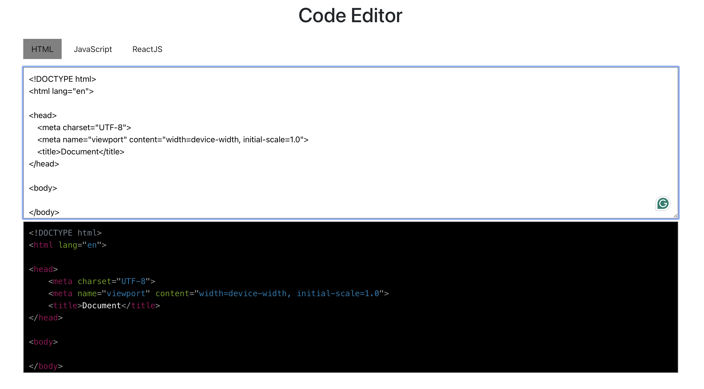

# Syntax-highlighter

## 📌 Introduction

[](https://awesome.re)

Real-time syntax highlighting for HTML, JavaScript, and React improves code readability by colorizing keywords,
variables, and tags. This feature aids in quick error detection and enhances overall development efficiency, ensuring a
streamlined coding experience.

## 🛠️ Installation Steps

Star and Fork the Repo 🌟 and this will keep us motivated.

1. Clone the repository

```bash
git clone https://github.com/subhashdippu/Syntax-highlight-editor.git
```

2. Change the working directory

```bash
cd Code-editor
```

3. Install dependencies

```bash
npm install
```

4. Run the app

```bash
npm run start
```


## 📸 Screenshots

